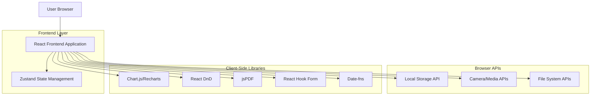
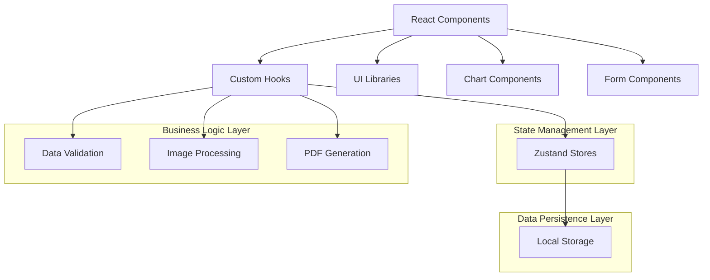
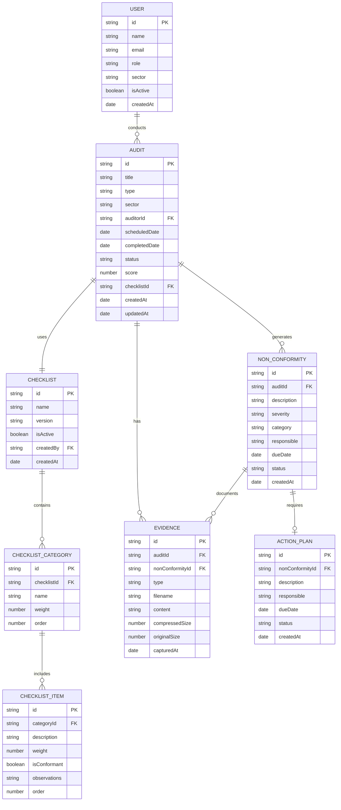

# Documento de Arquitetura Técnica - AuditPro

## 1. Architecture design



## 2. Technology Description

- **Frontend**: React@18 + TypeScript@5 + Vite@5 + Tailwind CSS@3
- **State Management**: Zustand@4 para gerenciamento de estado global
- **UI Components**: Headless UI + Radix UI para componentes acessíveis
- **Charts**: Recharts@2 para gráficos interativos e responsivos
- **Drag & Drop**: @dnd-kit/core para funcionalidades de arrastar e soltar
- **Forms**: React Hook Form@7 + Zod@3 para validação de formulários
- **Date Handling**: date-fns@2 para manipulação de datas
- **PDF Generation**: jsPDF@2 + html2canvas@1 para geração de relatórios
- **Image Processing**: browser-image-compression@2 para compressão de imagens
- **Icons**: Lucide React@0.263 para ícones consistentes
- **Backend**: Nenhum (MVP standalone)

## 3. Route definitions

| Route | Purpose |
|-------|---------|
| / | Dashboard principal com KPIs e gráficos (acesso direto) |
| /dashboard | Dashboard principal com KPIs e gráficos |
| /planning | Módulo de planejamento com calendário visual |
| /audits | Listagem e gestão de auditorias |
| /audits/new | Formulário de criação de nova auditoria |
| /audits/:id | Detalhes e edição de auditoria específica |
| /audits/:id/execute | Interface de execução de auditoria (mobile-optimized) |
| /non-conformities | Gestão de não conformidades |
| /non-conformities/:id | Detalhes de não conformidade específica |
| /checklists | Editor de checklists e templates |
| /checklists/:id | Edição de checklist específico |
| /reports | Geração e visualização de relatórios |
| /reports/generate | Interface de criação de relatórios personalizados |
| /settings | Configurações gerais do sistema |
| /settings/users | Gestão de usuários (implementação futura) |
| /settings/criteria | Configuração de critérios de avaliação |

## 4. API definitions (Client-Side Data Management)

### 4.1 Core Data Types

**Auditoria**
```typescript
interface Audit {
  id: string;
  title: string;
  type: 'interna' | 'externa' | 'fornecedor';
  sector: string;
  auditor: User;
  scheduledDate: Date;
  completedDate?: Date;
  status: 'planejada' | 'em_andamento' | 'concluida' | 'cancelada';
  score?: number;
  checklist: Checklist;
  nonConformities: NonConformity[];
  evidences: Evidence[];
  createdAt: Date;
  updatedAt: Date;
}
```

**Usuário**
```typescript
interface User {
  id: string;
  name: string;
  email: string;
  role: 'administrador' | 'coordenador' | 'auditor' | 'visualizador';
  sector: string;
  isActive: boolean;
  createdAt: Date;
}
```

**Checklist**
```typescript
interface Checklist {
  id: string;
  name: string;
  version: string;
  categories: ChecklistCategory[];
  isActive: boolean;
  createdBy: string;
  createdAt: Date;
}

interface ChecklistCategory {
  id: string;
  name: string;
  weight: number;
  items: ChecklistItem[];
}

interface ChecklistItem {
  id: string;
  description: string;
  weight: number;
  isConformant?: boolean;
  observations?: string;
  evidences?: Evidence[];
}
```

**Não Conformidade**
```typescript
interface NonConformity {
  id: string;
  auditId: string;
  description: string;
  severity: 'baixa' | 'media' | 'alta' | 'critica';
  category: string;
  responsible: string;
  dueDate: Date;
  status: 'aberta' | 'em_tratamento' | 'fechada';
  actionPlan?: ActionPlan;
  evidences: Evidence[];
  createdAt: Date;
}
```

**Evidência**
```typescript
interface Evidence {
  id: string;
  type: 'photo' | 'document' | 'note';
  filename?: string;
  content: string; // base64 para imagens, texto para notas
  compressedSize?: number;
  originalSize?: number;
  capturedAt: Date;
}
```

### 4.2 Local Storage Schema

```typescript
// Estrutura de dados no localStorage (MVP sem autenticação)
interface AppData {
  audits: Audit[];
  checklists: Checklist[];
  nonConformities: NonConformity[];
  settings: {
    scoringCriteria: ScoringCriteria;
    sectors: string[];
    auditTypes: string[];
    defaultUser: {
      id: string;
      name: string;
      role: 'administrador';
    };
  };
  // Campos para implementação futura
  users?: User[];
  currentUser?: User | null;
}
```

## 5. Client-Side Architecture



## 6. Data model

### 6.1 Data model definition



### 6.2 Local Storage Implementation

**Inicialização do Sistema**
```typescript
// Estrutura inicial do localStorage
const initializeAppData = (): AppData => ({
  users: [
    {
      id: 'admin-001',
      name: 'Administrador',
      email: 'admin@auditpro.com',
      role: 'administrador',
      sector: 'TI',
      isActive: true,
      createdAt: new Date()
    }
  ],
  audits: [],
  checklists: [
    {
      id: 'checklist-iso9001',
      name: 'ISO 9001 - Produção',
      version: '1.0',
      categories: [
        {
          id: 'cat-001',
          name: 'Gestão da Qualidade',
          weight: 30,
          items: [
            {
              id: 'item-001',
              description: 'Política da qualidade está documentada e comunicada',
              weight: 10
            }
          ]
        }
      ],
      isActive: true,
      createdBy: 'admin-001',
      createdAt: new Date()
    }
  ],
  nonConformities: [],
  settings: {
    scoringCriteria: {
      excellent: { min: 90, max: 100, color: '#059669' },
      good: { min: 80, max: 89, color: '#3B82F6' },
      acceptable: { min: 70, max: 79, color: '#F59E0B' },
      poor: { min: 0, max: 69, color: '#DC2626' }
    },
    sectors: ['Produção', 'Qualidade', 'Logística', 'Manutenção', 'Administrativo'],
    auditTypes: ['Interna', 'Externa', 'Fornecedor']
  },
  currentUser: null
});

// Funções de persistência
const saveToStorage = (key: string, data: any) => {
  localStorage.setItem(key, JSON.stringify(data));
};

const loadFromStorage = (key: string) => {
  const data = localStorage.getItem(key);
  return data ? JSON.parse(data) : null;
};
```

**Zustand Store Configuration**
```typescript
interface AppStore {
  // State
  users: User[];
  audits: Audit[];
  checklists: Checklist[];
  nonConformities: NonConformity[];
  currentUser: User | null;
  
  // Actions
  login: (email: string, password: string) => boolean;
  logout: () => void;
  createAudit: (audit: Omit<Audit, 'id' | 'createdAt' | 'updatedAt'>) => void;
  updateAudit: (id: string, updates: Partial<Audit>) => void;
  deleteAudit: (id: string) => void;
  
  // Persistence
  saveData: () => void;
  loadData: () => void;
}
```