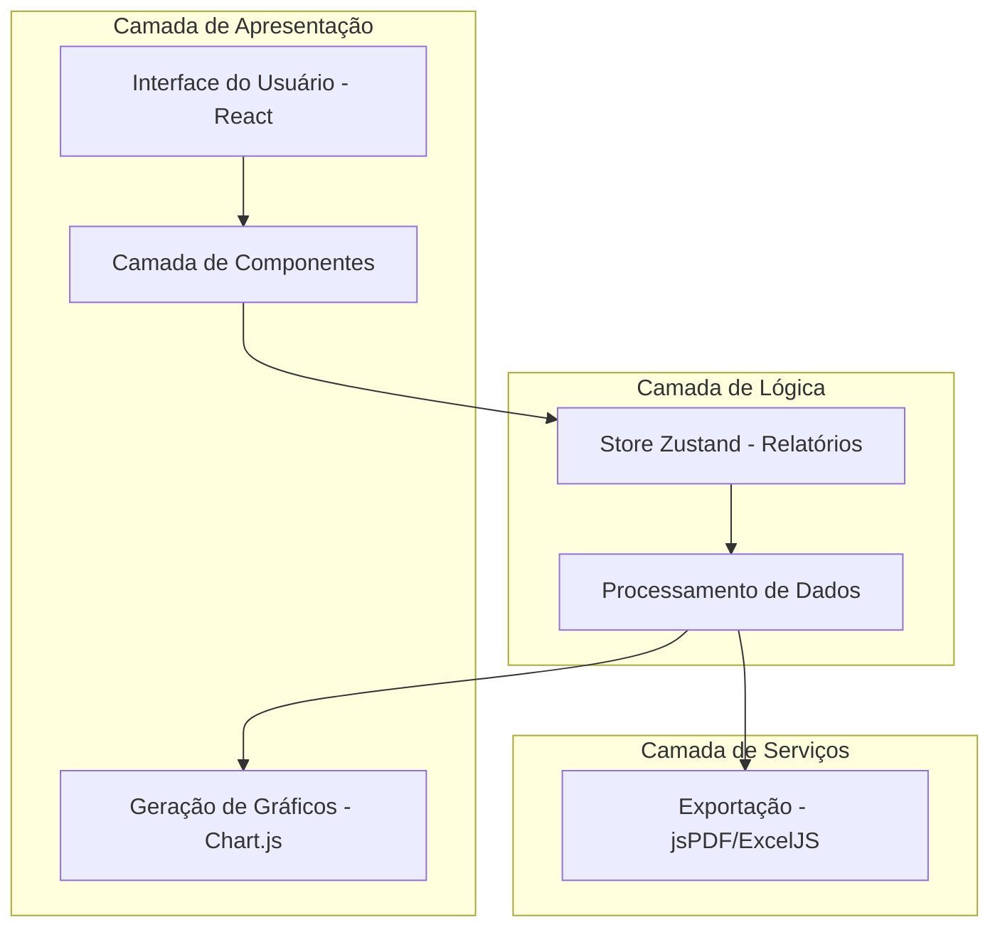
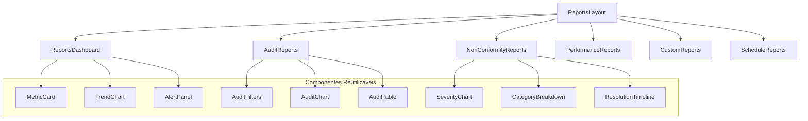
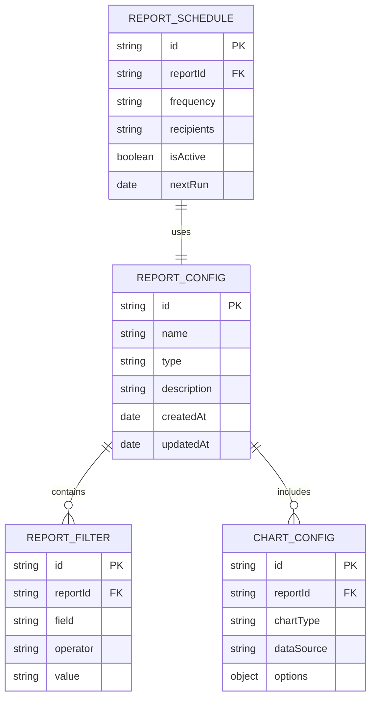

# Arquitetura Técnica - Módulo de Relatórios AuditPro

## 1. Arquitetura do Sistema



## 2. Stack Tecnológica

- **Frontend**: React@18 + TypeScript + Tailwind CSS + Vite
- **Gerenciamento de Estado**: Zustand para store de relatórios
- **Visualização de Dados**: Chart.js + React-Chartjs-2
- **Exportação**: jsPDF (PDF) + ExcelJS (Excel) + Papa Parse (CSV)
- **Componentes UI**: Headless UI + Lucide React (ícones)
- **Processamento de Dados**: Date-fns para manipulação de datas

## 3. Definição de Rotas

| Rota | Propósito |
|------|-----------|
| /reports | Dashboard principal de relatórios com visão geral e KPIs |
| /reports/audits | Relatórios detalhados de auditorias com filtros avançados |
| /reports/non-conformities | Análise de não conformidades por severidade e categoria |
| /reports/performance | Métricas de performance e produtividade da equipe |
| /reports/custom | Construtor de relatórios personalizados |
| /reports/schedule | Configuração e gerenciamento de relatórios automáticos |

## 4. Definições de API (Processamento Local)

### 4.1 Store de Relatórios

**Geração de métricas de auditoria**
```typescript
interface AuditMetrics {
  totalAudits: number;
  completedAudits: number;
  pendingAudits: number;
  averageCompletionTime: number;
  complianceRate: number;
}

// Função de processamento
const generateAuditMetrics = (audits: Audit[], dateRange: DateRange): AuditMetrics
```

**Parâmetros de entrada**:
| Nome do Parâmetro | Tipo | Obrigatório | Descrição |
|-------------------|------|-------------|-----------|
| audits | Audit[] | true | Array de auditorias do store |
| dateRange | DateRange | true | Período para análise (início e fim) |

**Resposta**:
| Nome do Parâmetro | Tipo | Descrição |
|-------------------|------|-----------|
| totalAudits | number | Total de auditorias no período |
| completedAudits | number | Auditorias concluídas |
| pendingAudits | number | Auditorias pendentes |
| averageCompletionTime | number | Tempo médio de conclusão em dias |
| complianceRate | number | Taxa de conformidade (0-100) |

**Exemplo de uso**:
```typescript
const metrics = generateAuditMetrics(audits, {
  startDate: new Date('2024-01-01'),
  endDate: new Date('2024-12-31')
});
```

## 5. Arquitetura de Componentes



## 6. Modelo de Dados

### 6.1 Definição do Modelo de Dados



### 6.2 Estruturas de Dados (TypeScript)

**Configuração de Relatório**
```typescript
interface ReportConfig {
  id: string;
  name: string;
  type: 'audit' | 'non-conformity' | 'performance' | 'custom';
  description: string;
  filters: ReportFilter[];
  charts: ChartConfig[];
  createdAt: Date;
  updatedAt: Date;
}

interface ReportFilter {
  id: string;
  field: string;
  operator: 'equals' | 'contains' | 'greater' | 'less' | 'between';
  value: string | number | Date | [Date, Date];
}

interface ChartConfig {
  id: string;
  type: 'bar' | 'line' | 'pie' | 'doughnut' | 'radar' | 'area';
  title: string;
  dataSource: string;
  xAxis: string;
  yAxis: string;
  options: ChartOptions;
}
```

**Agendamento de Relatórios**
```typescript
interface ReportSchedule {
  id: string;
  reportId: string;
  name: string;
  frequency: 'daily' | 'weekly' | 'monthly' | 'quarterly';
  recipients: string[];
  format: 'pdf' | 'excel' | 'csv';
  isActive: boolean;
  nextRun: Date;
  lastRun?: Date;
  createdBy: string;
}
```

**Métricas Calculadas**
```typescript
interface DashboardMetrics {
  audits: {
    total: number;
    completed: number;
    pending: number;
    overdue: number;
    completionRate: number;
  };
  nonConformities: {
    total: number;
    critical: number;
    high: number;
    medium: number;
    low: number;
    resolved: number;
    resolutionRate: number;
  };
  performance: {
    averageAuditTime: number;
    auditorsProductivity: AuditorMetric[];
    departmentCompliance: DepartmentMetric[];
    trendsData: TrendData[];
  };
}

interface AuditorMetric {
  auditorId: string;
  auditorName: string;
  totalAudits: number;
  averageTime: number;
  complianceRate: number;
  efficiency: number;
}
```