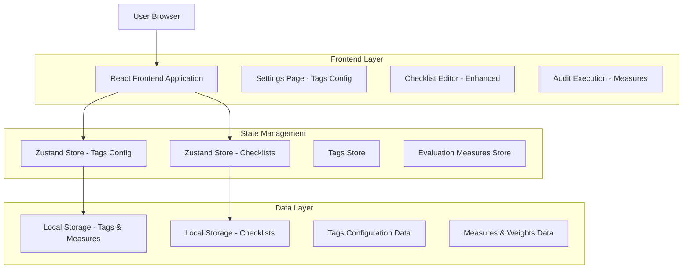
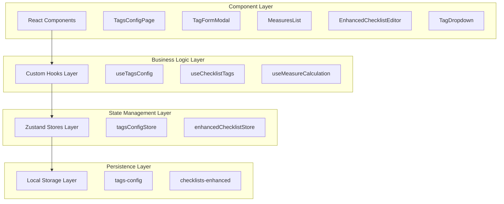
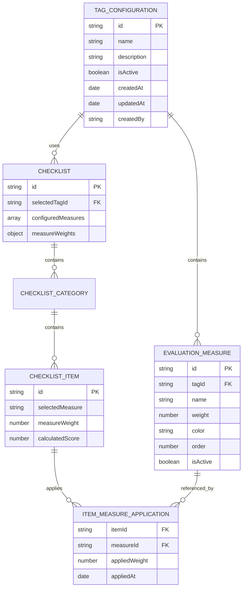

# Arquitetura Técnica - Sistema de Tags Configurável para Checklists

## 1. Arquitetura de Design



## 2. Descrição da Tecnologia

- Frontend: React@18 + TypeScript + tailwindcss@3 + vite
- State Management: Zustand (existing pattern)
- Data Storage: Local Storage (consistent with current architecture)
- UI Components: Lucide React icons + custom components
- Form Management: React Hook Form + Zod validation

## 3. Definições de Rotas

| Rota | Propósito |
|------|-----------|
| /settings | Página de configurações com nova aba "Tags e Medidas de Avaliação" |
| /checklists/new | Editor de checklist aprimorado com dropdown de tags |
| /checklists/edit/:id | Editor de checklist existente com suporte a tags configuráveis |
| /audits/execution/:id | Execução de auditoria com medidas configuradas automaticamente |

## 4. Definições de API (Estruturas de Dados Locais)

### 4.1 Interfaces TypeScript

**Tag Configuration**
```typescript
interface TagConfiguration {
  id: string;
  name: string;
  description?: string;
  isActive: boolean;
  createdAt: Date;
  updatedAt: Date;
  createdBy: string;
  measures: EvaluationMeasure[];
}

interface EvaluationMeasure {
  id: string;
  name: string;
  weight: number; // Peso em porcentagem (0-200)
  color?: string; // Cor para identificação visual
  order: number;
  isActive: boolean;
}
```

**Enhanced Checklist Interface**
```typescript
interface EnhancedChecklist extends Checklist {
  selectedTagId?: string;
  configuredMeasures?: EvaluationMeasure[];
  measureWeights?: Record<string, number>;
}

interface ChecklistItemWithMeasures extends ChecklistItem {
  selectedMeasure?: string; // ID da medida selecionada
  measureWeight?: number; // Peso aplicado da medida
  calculatedScore?: number; // Pontuação calculada com peso
}
```

### 4.2 Store Actions

**Tags Configuration Store**
```typescript
interface TagsConfigStore {
  // State
  tags: TagConfiguration[];
  selectedTag: TagConfiguration | null;
  isLoading: boolean;
  
  // Actions
  createTag: (tag: Omit<TagConfiguration, 'id' | 'createdAt' | 'updatedAt'>) => void;
  updateTag: (id: string, updates: Partial<TagConfiguration>) => void;
  deleteTag: (id: string) => void;
  getTagById: (id: string) => TagConfiguration | undefined;
  getActiveTags: () => TagConfiguration[];
  
  // Measures Actions
  addMeasureToTag: (tagId: string, measure: Omit<EvaluationMeasure, 'id'>) => void;
  updateMeasure: (tagId: string, measureId: string, updates: Partial<EvaluationMeasure>) => void;
  removeMeasureFromTag: (tagId: string, measureId: string) => void;
  validateMeasureWeights: (tagId: string) => boolean; // Verifica se soma = 100%
}
```

**Enhanced Checklist Store**
```typescript
interface EnhancedChecklistStore extends ChecklistStore {
  // New Actions
  setChecklistTag: (checklistId: string, tagId: string) => void;
  loadMeasuresForChecklist: (checklistId: string, tagId: string) => void;
  calculateScoreWithWeights: (checklistId: string) => number;
  applyMeasureToItem: (checklistId: string, itemId: string, measureId: string) => void;
}
```

## 5. Arquitetura do Servidor (Frontend Only)



## 6. Modelo de Dados

### 6.1 Definição do Modelo de Dados



### 6.2 Estruturas de Dados Local Storage

**Tags Configuration Storage**
```typescript
// Local Storage Key: 'audita-pro-tags-config'
interface TagsConfigStorage {
  tags: TagConfiguration[];
  lastUpdated: Date;
  version: string;
}

// Exemplo de dados iniciais
const defaultTagsConfig: TagConfiguration[] = [
  {
    id: 'tag-ona-001',
    name: 'Norma ONA',
    description: 'Organização Nacional de Acreditação',
    isActive: true,
    createdAt: new Date(),
    updatedAt: new Date(),
    createdBy: 'system',
    measures: [
      {
        id: 'measure-ona-001',
        name: 'Conforme',
        weight: 100,
        color: '#10B981',
        order: 1,
        isActive: true
      },
      {
        id: 'measure-ona-002',
        name: 'Não Conforme',
        weight: 0,
        color: '#EF4444',
        order: 2,
        isActive: true
      },
      {
        id: 'measure-ona-003',
        name: 'Parcial Conforme',
        weight: 50,
        color: '#F59E0B',
        order: 3,
        isActive: true
      },
      {
        id: 'measure-ona-004',
        name: 'Supera',
        weight: 120,
        color: '#8B5CF6',
        order: 4,
        isActive: true
      },
      {
        id: 'measure-ona-005',
        name: 'Não se Aplica',
        weight: 0,
        color: '#6B7280',
        order: 5,
        isActive: true
      }
    ]
  }
];
```

**Enhanced Checklists Storage**
```typescript
// Local Storage Key: 'audita-pro-checklists-enhanced'
interface EnhancedChecklistStorage {
  checklists: EnhancedChecklist[];
  measureApplications: ItemMeasureApplication[];
  lastUpdated: Date;
  version: string;
}

// Estrutura de aplicação de medidas
interface ItemMeasureApplication {
  id: string;
  checklistId: string;
  itemId: string;
  measureId: string;
  appliedWeight: number;
  appliedAt: Date;
  calculatedScore: number;
}
```

**Migration Strategy**
```typescript
// Função para migrar checklists existentes
const migrateExistingChecklists = () => {
  const existingChecklists = getFromStorage('audita-pro-checklists');
  const enhancedChecklists = existingChecklists.map(checklist => ({
    ...checklist,
    selectedTagId: null,
    configuredMeasures: [],
    measureWeights: {}
  }));
  
  saveToStorage('audita-pro-checklists-enhanced', {
    checklists: enhancedChecklists,
    measureApplications: [],
    lastUpdated: new Date(),
    version: '1.0.0'
  });
};
```

## 7. Implementação de Segurança

### 7.1 Validação de Dados
- Validação de pesos: soma deve ser exatamente 100%
- Sanitização de inputs para nomes de tags e medidas
- Validação de unicidade de nomes de tags
- Verificação de dependências antes de exclusão

### 7.2 Controle de Acesso
- Verificação de permissões para criação/edição de tags
- Auditoria de mudanças em configurações
- Backup automático antes de alterações críticas
- Validação de integridade dos dados no Local Storage

### 7.3 Tratamento de Erros
- Fallback para configurações padrão em caso de corrupção
- Validação de estrutura de dados ao carregar do storage
- Logs de erro para debugging de problemas de configuração
- Recovery automático de dados corrompidos quando possível