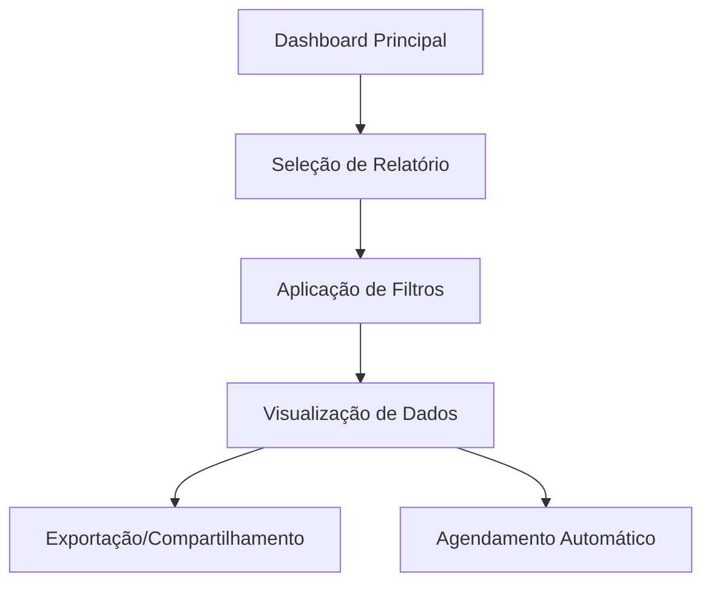

# PRD - Módulo de Relatórios AuditPro

## 1. Visão Geral do Produto

O Módulo de Relatórios do AuditPro é uma solução abrangente de business intelligence que transforma dados de auditorias em insights acionáveis através de dashboards interativos, relatórios customizáveis e visualizações avançadas.

- **Objetivo Principal**: Fornecer análises detalhadas e métricas de performance para otimizar processos de auditoria interna
- **Público-Alvo**: Gestores de qualidade, auditores seniores, diretoria executiva e coordenadores de compliance
- **Valor de Mercado**: Redução de 60% no tempo de análise de dados e aumento de 40% na eficácia das auditorias através de insights baseados em dados

## 2. Funcionalidades Principais

### 2.1 Papéis de Usuário

| Papel | Método de Acesso | Permissões Principais |
|-------|------------------|----------------------|
| Gestor Executivo | Login com perfil executivo | Visualizar relatórios executivos, exportar dados estratégicos, configurar alertas |
| Coordenador de Auditoria | Login com perfil coordenador | Gerar todos os tipos de relatórios, agendar relatórios automáticos, gerenciar dashboards |
| Auditor Senior | Login com perfil auditor | Visualizar relatórios operacionais, exportar dados de suas auditorias |

### 2.2 Especificação de Módulos

Nosso módulo de relatórios consiste nas seguintes páginas principais:

1. **Dashboard Principal**: visão geral com KPIs, gráficos de tendências, alertas críticos
2. **Relatórios de Auditorias**: análises detalhadas por período, status, tipo e auditor
3. **Relatórios de Não Conformidades**: métricas de severidade, categorização e resolução
4. **Relatórios de Performance**: produtividade, tempo médio, taxa de conclusão
5. **Relatórios Customizados**: construtor de relatórios com filtros avançados
6. **Agendamento**: configuração de relatórios automáticos e notificações

### 2.3 Detalhes das Páginas

| Página | Módulo | Descrição da Funcionalidade |
|--------|--------|----------------------------|
| Dashboard Principal | Visão Geral | Exibir KPIs em tempo real, gráficos de tendências, alertas críticos, resumo executivo com métricas consolidadas |
| Relatórios de Auditorias | Análise de Auditorias | Filtrar por período/status/tipo, visualizar gráficos de barras e linhas, exportar dados, comparar períodos |
| Relatórios de NCs | Análise de Conformidade | Categorizar por severidade, mapear responsáveis, timeline de resolução, taxa de recorrência |
| Relatórios de Performance | Produtividade | Calcular tempo médio por auditoria, taxa de conclusão, ranking de auditores, eficiência por departamento |
| Relatórios Customizados | Construtor | Selecionar campos personalizados, aplicar filtros avançados, salvar templates, compartilhar relatórios |
| Agendamento | Automação | Configurar frequência de envio, definir destinatários, personalizar formatos, gerenciar histórico |

## 3. Fluxo Principal de Processos

### Fluxo do Gestor Executivo
O gestor acessa o dashboard principal, visualiza KPIs estratégicos, identifica tendências críticas, exporta relatório executivo para apresentação à diretoria e configura alertas para métricas importantes.

### Fluxo do Coordenador de Auditoria
O coordenador acessa relatórios detalhados, aplica filtros por departamento/período, analisa performance da equipe, agenda relatórios automáticos semanais e compartilha insights com stakeholders.

## 4. Design da Interface do Usuário

### 4.1 Estilo de Design

- **Cores Primárias**: Azul corporativo (#2563eb), Verde sucesso (#16a34a)
- **Cores Secundárias**: Cinza neutro (#64748b), Laranja alerta (#ea580c), Vermelho crítico (#dc2626)
- **Estilo de Botões**: Arredondados com sombra sutil, hover com transição suave
- **Tipografia**: Inter (títulos 18-24px), Open Sans (corpo 14-16px)
- **Layout**: Grid responsivo com cards modulares, sidebar fixa, header com breadcrumbs
- **Ícones**: Lucide React com estilo outline, tamanho 20-24px para consistência visual

### 4.2 Visão Geral do Design das Páginas

| Página | Módulo | Elementos da Interface |
|--------|--------|----------------------|
| Dashboard Principal | Visão Geral | Cards de KPIs com ícones coloridos, gráficos interativos Chart.js, layout em grid 3x2, paleta azul/verde/laranja |
| Relatórios de Auditorias | Análise | Filtros dropdown múltiplos, tabela DataTable responsiva, gráficos de barras/linhas, botões de exportação |
| Relatórios de NCs | Conformidade | Mapa de calor por severidade, timeline vertical, badges coloridos por status, cards estatísticos |
| Performance | Produtividade | Gráficos de radar para comparação, ranking com avatares, métricas em tempo real, progress bars |
| Customizados | Construtor | Drag-and-drop para campos, preview em tempo real, templates salvos, wizard de configuração |
| Agendamento | Automação | Calendário interativo, formulário de configuração, histórico de envios, toggle switches |

### 4.3 Responsividade

O módulo é desenvolvido com abordagem mobile-first, adaptando-se automaticamente para tablets e desktops. Em dispositivos móveis, os gráficos se transformam em visualizações simplificadas e os filtros são agrupados em modais para otimizar o espaço de tela.