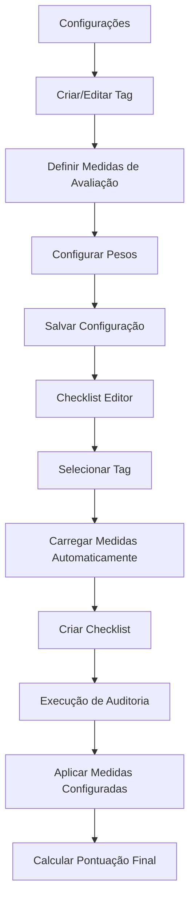

# Sistema de Tags Configurável para Checklists - Documento de Requisitos do Produto

## 1. Visão Geral do Produto

Este documento especifica as melhorias necessárias para implementar um sistema de tags configurável no módulo de Checklists, permitindo que administradores definam tags personalizadas com medidas de avaliação específicas e seus respectivos pesos. O sistema automatizará a aplicação dessas configurações durante a criação e execução de checklists, garantindo padronização e flexibilidade na avaliação de conformidade.

O objetivo é substituir o sistema atual de tags livres por um sistema estruturado que permita configurações personalizadas para diferentes normas e padrões de auditoria, como "Norma ONA", com medidas de avaliação pré-definidas e pesos específicos para cálculo automático de pontuação.

## 2. Funcionalidades Principais

### 2.1 Papéis de Usuário

| Papel | Método de Acesso | Permissões Principais |
|-------|------------------|----------------------|
| Administrador | Login com credenciais admin | Pode configurar tags, medidas de avaliação, pesos e gerenciar todo o sistema |
| Auditor | Login com credenciais de auditor | Pode criar checklists usando tags configuradas, mas não pode alterar configurações |
| Usuário Comum | Login padrão | Pode visualizar checklists e executar auditorias conforme permissões |

### 2.2 Módulos de Funcionalidade

Nossos requisitos consistem nas seguintes páginas principais:

1. **Configurações - Tags e Medidas**: Gerenciamento de tags, medidas de avaliação e pesos
2. **Checklists - Editor Aprimorado**: Campo de seleção de tags com carregamento automático de medidas
3. **Execução de Auditoria**: Aplicação automática das medidas configuradas durante a execução

### 2.3 Detalhes das Páginas

| Nome da Página | Nome do Módulo | Descrição da Funcionalidade |
|----------------|----------------|----------------------------|
| Configurações | Aba "Tags e Medidas de Avaliação" | Criar, editar e excluir tags personalizadas. Definir medidas de avaliação para cada tag. Configurar pesos/pontuações para cada medida. Validar configurações antes de salvar. |
| Configurações | Lista de Tags Configuradas | Exibir todas as tags cadastradas em formato de tabela. Mostrar quantidade de medidas por tag. Permitir ações de editar, duplicar e excluir. Filtros de busca por nome da tag. |
| Configurações | Formulário de Tag | Campos para nome da tag, descrição e status ativo/inativo. Seção para adicionar/remover medidas de avaliação. Campos de peso numérico para cada medida. Validação de soma de pesos (deve totalizar 100%). |
| Checklists | Campo Tags (Dropdown) | Substituir input livre por dropdown de seleção. Carregar tags ativas do sistema de configuração. Permitir seleção única ou múltipla conforme necessário. Atualizar medidas automaticamente ao selecionar tag. |
| Checklists | Medidas de Avaliação Automáticas | Carregar medidas baseadas na tag selecionada. Exibir pesos configurados para cada medida. Aplicar automaticamente nas categorias e itens do checklist. Calcular pontuação final usando pesos configurados. |
| Execução de Auditoria | Avaliação com Medidas Configuradas | Apresentar apenas as medidas válidas para a tag selecionada. Aplicar pesos automaticamente no cálculo da pontuação. Validar conformidade baseada nas medidas configuradas. Gerar relatórios com base nas configurações da tag. |

## 3. Processo Principal

### Fluxo do Administrador:
1. Acessa Configurações → Tags e Medidas de Avaliação
2. Cria nova tag (ex: "Norma ONA")
3. Define medidas de avaliação (Conforme, Não Conforme, Parcial Conforme, Supera, Não se Aplica)
4. Configura pesos para cada medida (ex: Conforme=100%, Não Conforme=0%, Parcial=50%, Supera=120%, N/A=0%)
5. Salva e ativa a configuração

### Fluxo do Auditor:
1. Acessa Checklists → Novo Checklist
2. Seleciona tag no dropdown (ex: "Norma ONA")
3. Sistema carrega automaticamente as medidas configuradas
4. Cria categorias e itens do checklist
5. Sistema aplica automaticamente os pesos configurados

### Fluxo de Execução:
1. Durante execução da auditoria, sistema apresenta apenas medidas válidas
2. Auditor seleciona medida apropriada para cada item
3. Sistema calcula pontuação automaticamente usando pesos configurados
4. Gera relatório final com base nas configurações da tag

## 4. Design da Interface do Usuário

### 4.1 Estilo de Design

- **Cores Primárias**: Azul (#3B82F6) para elementos principais, Verde (#10B981) para confirmações
- **Cores Secundárias**: Cinza (#6B7280) para textos secundários, Vermelho (#EF4444) para alertas
- **Estilo de Botões**: Arredondados com bordas suaves, efeito hover sutil
- **Fontes**: Inter ou system fonts, tamanhos 14px (corpo), 16px (títulos), 12px (labels)
- **Layout**: Baseado em cards com espaçamento consistente, navegação por abas
- **Ícones**: Lucide React icons para consistência visual

### 4.2 Visão Geral do Design das Páginas

| Nome da Página | Nome do Módulo | Elementos da UI |
|----------------|----------------|-----------------|
| Configurações | Aba Tags e Medidas | Nova aba no menu lateral. Título "Tags e Medidas de Avaliação". Botão "Nova Tag" no canto superior direito. Tabela responsiva com colunas: Nome, Descrição, Medidas, Status, Ações. |
| Configurações | Modal de Criação/Edição | Modal centralizado com largura 600px. Campos: Nome da tag (input), Descrição (textarea), Status (toggle). Seção "Medidas de Avaliação" com lista dinâmica. Botões de ação no rodapé. |
| Configurações | Lista de Medidas | Cards expansíveis para cada medida. Campos: Nome da medida, Peso (input numérico com %), Cor identificadora. Botões para adicionar/remover medidas. Validação visual da soma dos pesos. |
| Checklists | Campo Tags Atualizado | Dropdown estilizado substituindo input livre. Placeholder "Selecione uma tag...". Ícone de seta para indicar dropdown. Lista de opções com busca integrada. |
| Checklists | Medidas Carregadas | Seção "Medidas de Avaliação" aparece após seleção da tag. Cards com nome da medida e peso. Indicador visual de carregamento automático. Botão para recarregar se necessário. |
| Execução | Interface de Avaliação | Botões de medida estilizados com cores específicas. Peso da medida exibido em cada botão. Indicador de pontuação em tempo real. Barra de progresso com base nos pesos. |

### 4.3 Responsividade

O sistema será desktop-first com adaptação para tablets e dispositivos móveis. Em telas menores, as tabelas se transformarão em cards empilhados, e os modais ocuparão toda a largura da tela. Interações touch serão otimizadas para seleção de medidas durante a execução de auditorias.

## 5. Regras de Negócio

### 5.1 Validações de Tags
- Nome da tag deve ser único no sistema
- Pelo menos uma medida de avaliação deve ser configurada
- Soma dos pesos deve totalizar exatamente 100%
- Tags não podem ser excluídas se estiverem em uso em checklists ativos

### 5.2 Medidas de Avaliação
- Cada medida deve ter nome único dentro da tag
- Pesos devem ser números positivos entre 0 e 200%
- Pelo menos uma medida deve ter peso maior que 0%
- Medidas não podem ser removidas se estiverem em uso

### 5.3 Integração com Checklists
- Ao selecionar uma tag, medidas são carregadas automaticamente
- Mudança de tag requer confirmação se checklist já possui itens
- Cálculo de pontuação usa sempre os pesos mais atuais da configuração
- Histórico de configurações é mantido para auditoria de mudanças

### 5.4 Cálculo de Pontuação
- Pontuação final = Σ(peso_medida × quantidade_itens_medida) / total_itens
- Medidas "Não se Aplica" não contam no denominador
- Pontuação é arredondada para 2 casas decimais
- Relatórios mostram detalhamento por medida utilizada